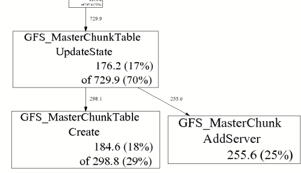

# Gperftools Heap Profiler 

This is the heap profiler we use at Google, to explore how C++ programs manage memory. This facility can be useful for

*   Figuring out what is in the program heap at any given time
*   Locating memory leaks
*   Finding places that do a lot of allocation

The profiling system instruments all allocations and frees. It keeps track of various pieces of information per allocation site. An allocation site is defined as the active stack trace at the call to `malloc`, `calloc`, `realloc`, or, `new`.

There are three parts to using it: linking the library into an application, running the code, and analyzing the output.

## Summary 

- [Linking in the Library](#section-id-13)
- [Running the Code](#section-id-21)
  - [Modifying Runtime Behavior](#section-id-33)
  - [Checking for Leaks](#section-id-77)
- [Analyzing the Output](#section-id-81)
    - [Why is a process so big](#section-id-105)
    - [Comparing Profiles](#section-id-118)
    - [Text display](#section-id-127)
    - [Ignoring or focusing on specific regions](#section-id-145)
    - [Total allocations + object-level information](#section-id-157)
    - [Interactive mode](#section-id-184)
- [Caveats](#section-id-188)


<div id='section-id-13'/>

## Linking in the Library

To install the heap profiler into your executable, add `-ltcmalloc` to the link-time step for your executable. Also, while we don't necessarily recommend this form of usage, it's possible to add in the profiler at run-time using `LD_PRELOAD`:

<pre>% env LD_PRELOAD="/usr/lib/libtcmalloc.so" &lt;binary&gt;</pre>

This does _not_ turn on heap profiling; it just inserts the code. For that reason, it's practical to just always link `-ltcmalloc` into a binary while developing; that's what we do at Google. (However, since any user can turn on the profiler by setting an environment variable, it's not necessarily recommended to install profiler-linked binaries into a production, running system.) Note that if you wish to use the heap profiler, you must also use the tcmalloc memory-allocation library. There is no way currently to use the heap profiler separate from tcmalloc.

<div id='section-id-21'/>

## Running the Code

There are several alternatives to actually turn on heap profiling for a given run of an executable:

1.  Define the environment variable HEAPPROFILE to the filename to dump the profile to. For instance, to profile `/usr/local/bin/my_binary_compiled_with_tcmalloc`:

    <pre>% env HEAPPROFILE=/tmp/mybin.hprof /usr/local/bin/my_binary_compiled_with_tcmalloc</pre>

2.  In your code, bracket the code you want profiled in calls to `HeapProfilerStart()` and `HeapProfilerStop()`. (These functions are declared in `<gperftools/heap-profiler.h>`.) `HeapProfilerStart()` will take the profile-filename-prefix as an argument. Then, as often as you'd like before calling `HeapProfilerStop()`, you can use `HeapProfilerDump()` or `GetHeapProfile()` to examine the profile. In case it's useful, `IsHeapProfilerRunning()` will tell you whether you've already called HeapProfilerStart() or not.

For security reasons, heap profiling will not write to a file -- and is thus not usable -- for setuid programs.

<div id='section-id-33'/>

### Modifying Runtime Behavior

You can more finely control the behavior of the heap profiler via environment variables.

<table frame="box" rules="sides" cellpadding="5" width="100%">
<tbody>
<tr valign="top">
<td><pre>HEAP_PROFILE_ALLOCATION_INTERVAL</pre></td>
<td>default: 1073741824 (1 Gb)</td>
<td>Dump heap profiling information each time the specified number of bytes has been allocated by the program.</td>
</tr>
<tr valign="top">
<td><pre>HEAP_PROFILE_INUSE_INTERVAL</pre></td>
<td>default: 104857600 (100 Mb)</td>
<td>Dump heap profiling information whenever the high-water memory usage mark increases by the specified number of bytes.</td>
</tr>
<tr valign="top">
<td><pre>HEAP_PROFILE_TIME_INTERVAL</pre></td>
<td>default: 0</td>
<td>Dump heap profiling information each time the specified number of seconds has elapsed.</td>
</tr>
<tr valign="top">
<td><pre>HEAPPROFILESIGNAL</pre></td>
<td>default: disabled</td>
<td>Dump heap profiling information whenever the specified signal is sent to the process.</td>
</tr>
<tr valign="top">
<td><pre>HEAP_PROFILE_MMAP</pre></td>
<td>default: false</td>
<td>Profile `mmap`, `mremap` and `sbrk` calls in addition to `malloc`, `calloc`, `realloc`, and `new`. **NOTE:** this causes the profiler to profile calls internal to tcmalloc, since tcmalloc and friends use mmap and sbrk internally for allocations. One partial solution is to filter these allocations out when running `pprof`, with something like `pprof --ignore='DoAllocWithArena|SbrkSysAllocator::Alloc|MmapSysAllocator::Alloc`.</td>
</tr>
<tr valign="top">
<td><pre>HEAP_PROFILE_ONLY_MMAP</pre></td>
<td>default: false</td>
<td>Only profile `mmap`, `mremap`, and `sbrk` calls; do not profile `malloc`, `calloc`, `realloc`, or `new`.</td>
</tr>
<tr valign="top">
<td><pre>HEAP_PROFILE_MMAP_LOG</pre></td>
<td>default: false</td>
<td>Log `mmap`/`munmap` calls.</td>
</tr>
</tbody>
</table>

<div id='section-id-77'/>

### Checking for Leaks

You can use the heap profiler to manually check for leaks, for instance by reading the profiler output and looking for large allocations. However, for that task, it's easier to use the [automatic heap-checking facility](heap_checker.md) built into tcmalloc.

<div id='section-id-81'/>

## Analyzing the Output

If heap-profiling is turned on in a program, the program will periodically write profiles to the filesystem. The sequence of profiles will be named:

```
           <prefix>.0000.heap
           <prefix>.0001.heap
           <prefix>.0002.heap
           ...
```

where `<prefix>` is the filename-prefix supplied when running the code (e.g. via the `HEAPPROFILE` environment variable). Note that if the supplied prefix does not start with a `/`, the profile files will be written to the program's working directory.

The profile output can be viewed by passing it to the `pprof` tool -- the same tool that's used to analyze [CPU profiles](cpuprofile.md).

Here are some examples. These examples assume the binary is named `gfs_master`, and a sequence of heap profile files can be found in files named:

```
  /tmp/profile.0001.heap
  /tmp/profile.0002.heap
  ...
  /tmp/profile.0100.heap
```

<div id='section-id-105'/>

#### Why is a process so big

<pre>    % pprof --gv gfs_master /tmp/profile.0100.heap</pre>

This command will pop-up a `gv` window that displays the profile information as a directed graph. Here is a portion of the resulting output:



A few explanations:

*   `GFS_MasterChunk::AddServer` accounts for 255.6 MB of the live memory, which is 25% of the total live memory.
*   `GFS_MasterChunkTable::UpdateState` is directly accountable for 176.2 MB of the live memory (i.e., it directly allocated 176.2 MB that has not been freed yet). Furthermore, it and its callees are responsible for 729.9 MB. The labels on the outgoing edges give a good indication of the amount allocated by each callee.

<div id='section-id-118'/>

#### Comparing Profiles

You often want to skip allocations during the initialization phase of a program so you can find gradual memory leaks. One simple way to do this is to compare two profiles -- both collected after the program has been running for a while. Specify the name of the first profile using the `--base` option. For example:

<pre>   % pprof --base=/tmp/profile.0004.heap gfs_master /tmp/profile.0100.heap
</pre>

The memory-usage in `/tmp/profile.0004.heap` will be subtracted from the memory-usage in `/tmp/profile.0100.heap` and the result will be displayed.

<div id='section-id-127'/>

#### Text display

```
   % pprof --text gfs_master /tmp/profile.0100.heap
   255.6  24.7%  24.7%    255.6  24.7% GFS_MasterChunk::AddServer
   184.6  17.8%  42.5%    298.8  28.8% GFS_MasterChunkTable::Create
   176.2  17.0%  59.5%    729.9  70.5% GFS_MasterChunkTable::UpdateState
   169.8  16.4%  75.9%    169.8  16.4% PendingClone::PendingClone
    76.3   7.4%  83.3%     76.3   7.4% __default_alloc_template::_S_chunk_alloc
    49.5   4.8%  88.0%     49.5   4.8% hashtable::resize
   ...
```

*   The first column contains the direct memory use in MB.
*   The fourth column contains memory use by the procedure and all of its callees.
*   The second and fifth columns are just percentage representations of the numbers in the first and fourth columns.
*   The third column is a cumulative sum of the second column (i.e., the `k`th entry in the third column is the sum of the first `k` entries in the second column.)

<div id='section-id-145'/>

#### Ignoring or focusing on specific regions

The following command will give a graphical display of a subset of the call-graph. Only paths in the call-graph that match the regular expression `DataBuffer` are included:

<pre>% pprof --gv --focus=DataBuffer gfs_master /tmp/profile.0100.heap
</pre>

Similarly, the following command will omit all paths subset of the call-graph. All paths in the call-graph that match the regular expression `DataBuffer` are discarded:

<pre>% pprof --gv --ignore=DataBuffer gfs_master /tmp/profile.0100.heap
</pre>

<div id='section-id-157'/>

#### Total allocations + object-level information

All of the previous examples have displayed the amount of in-use space. I.e., the number of bytes that have been allocated but not freed. You can also get other types of information by supplying a flag to `pprof`:

<center>
<table frame="box" rules="sides" cellpadding="5" width="100%">
<tbody>
<tr valign="top">
<td><pre>--inuse_space</pre></td>
<td>Display the number of in-use megabytes (i.e. space that has been allocated but not freed). This is the default.</td>
</tr>
<tr valign="top">
<td><pre>--inuse_objects</pre></td>
<td>Display the number of in-use objects (i.e. number of objects that have been allocated but not freed).</td>
</tr>
<tr valign="top">
<td><pre>--alloc_space</pre></td>
<td>Display the number of allocated megabytes. This includes the space that has since been de-allocated. Use this if you want to find the main allocation sites in the program.</td>
</tr>
<tr valign="top">
<td><pre>--alloc_objects</pre></td>
<td>Display the number of allocated objects. This includes the objects that have since been de-allocated. Use this if you want to find the main allocation sites in the program.</td>
</tr>
</tbody>
</table>
</center>

<div id='section-id-184'/>

#### Interactive mode

By default -- if you don't specify any flags to the contrary -- pprof runs in interactive mode. At the `(pprof)` prompt, you can run many of the commands described above. You can type `help` for a list of what commands are available in interactive mode.

<div id='section-id-188'/>

## Caveats

*   Heap profiling requires the use of libtcmalloc. This requirement may be removed in a future version of the heap profiler, and the heap profiler separated out into its own library.
*   If the program linked in a library that was not compiled with enough symbolic information, all samples associated with the library may be charged to the last symbol found in the program before the library. This will artificially inflate the count for that symbol.
*   If you run the program on one machine, and profile it on another, and the shared libraries are different on the two machines, the profiling output may be confusing: samples that fall within the shared libaries may be assigned to arbitrary procedures.
*   Several libraries, such as some STL implementations, do their own memory management. This may cause strange profiling results. We have code in libtcmalloc to cause STL to use tcmalloc for memory management (which in our tests is better than STL's internal management), though it only works for some STL implementations.
*   If your program forks, the children will also be profiled (since they inherit the same HEAPPROFILE setting). Each process is profiled separately; to distinguish the child profiles from the parent profile and from each other, all children will have their process-id attached to the HEAPPROFILE name.
*   Due to a hack we make to work around a possible gcc bug, your profiles may end up named strangely if the first character of your HEAPPROFILE variable has ascii value greater than 127. This should be exceedingly rare, but if you need to use such a name, just set prepend `./` to your filename: `HEAPPROFILE=./Ägypten`.

---

<address>
Sanjay Ghemawat
Last modified: Feb 2018
</address>

[Link to main documentation readme](readme.md)
