# TCMalloc : Thread-Caching Malloc

## Summary 

- [Motivation](#section-id-3)
- [Usage](#section-id-11)
- [Overview](#section-id-25)
- [Small Object Allocation](#section-id-35)
    - [Sizing Thread Cache Free Lists](#section-id-49)
- [Medium Object Allocation](#section-id-92)
- [Large Object Allocation](#section-id-93)
- [Spans](#section-id-102)
- [Deallocation](#section-id-114)
- [Central Free Lists for Small Objects](#section-id-120)
- [Garbage Collection of Thread Caches](#section-id-128)
- [Performance Notes](#section-id-148)
    - [PTMalloc2 unittest](#section-id-150)
- [Modifying Runtime Behavior](#section-id-204)
- [Modifying Behavior In Code](#section-id-290)
    - [Releasing Memory Back to the System](#section-id-294)
    - [Memory Introspection](#section-id-303)
    - [Generic Tcmalloc Status](#section-id-315)
- [Caveats](#section-id-359)
  


<div id='section-id-3'/>

## Motivation

TCMalloc is faster than the glibc 2.3 malloc (available as a separate library called ptmalloc2) and other mallocs that I have tested. ptmalloc2 takes approximately 300 nanoseconds to execute a malloc/free pair on a 2.8 GHz P4 (for small objects). The TCMalloc implementation takes approximately 50 nanoseconds for the same operation pair. Speed is important for a malloc implementation because if malloc is not fast enough, application writers are inclined to write their own custom free lists on top of malloc. This can lead to extra complexity, and more memory usage unless the application writer is very careful to appropriately size the free lists and scavenge idle objects out of the free list.

TCMalloc also reduces lock contention for multi-threaded programs. For small objects, there is virtually zero contention. For large objects, TCMalloc tries to use fine grained and efficient spinlocks. ptmalloc2 also reduces lock contention by using per-thread arenas but there is a big problem with ptmalloc2's use of per-thread arenas. In ptmalloc2 memory can never move from one arena to another. This can lead to huge amounts of wasted space. For example, in one Google application, the first phase would allocate approximately 300MB of memory for its URL canonicalization data structures. When the first phase finished, a second phase would be started in the same address space. If this second phase was assigned a different arena than the one used by the first phase, this phase would not reuse any of the memory left after the first phase and would add another 300MB to the address space. Similar memory blowup problems were also noticed in other applications.

Another benefit of TCMalloc is space-efficient representation of small objects. For example, N 8-byte objects can be allocated while using space approximately `8N * 1.01` bytes. I.e., a one-percent space overhead. ptmalloc2 uses a four-byte header for each object and (I think) rounds up the size to a multiple of 8 bytes and ends up using `16N` bytes.

<div id='section-id-11'/>

## Usage

To use TCMalloc, just link TCMalloc into your application via the "-ltcmalloc" linker flag.

You can use TCMalloc in applications you didn't compile yourself, by using LD_PRELOAD:

<pre>   $ LD_PRELOAD="/usr/lib/libtcmalloc.so" <binary></binary> </pre>

LD_PRELOAD is tricky, and we don't necessarily recommend this mode of usage.

TCMalloc includes a [heap checker](heap_checker.md) and [heap profiler](heapprofile.md) as well.

If you'd rather link in a version of TCMalloc that does not include the heap profiler and checker (perhaps to reduce binary size for a static binary), you can link in `libtcmalloc_minimal` instead.

<div id='section-id-25'/>

## Overview

TCMalloc assigns each thread a thread-local cache. Small allocations are satisfied from the thread-local cache. Objects are moved from central data structures into a thread-local cache as needed, and periodic garbage collections are used to migrate memory back from a thread-local cache into the central data structures.

<center>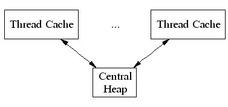</center>

TCMalloc treats objects with size <= 256K ("small" objects) differently from larger objects. Large objects are allocated directly from the central heap using a page-level allocator (a page is a 8K aligned region of memory). I.e., a large object is always page-aligned and occupies an integral number of pages.

A run of pages can be carved up into a sequence of small objects, each equally sized. For example a run of one page (4K) can be carved up into 32 objects of size 128 bytes each.

<div id='section-id-35'/>

## Small Object Allocation

Each small object size maps to one of approximately 88 allocatable size-classes. For example, all allocations in the range 961 to 1024 bytes are rounded up to 1024\. The size-classes are spaced so that small sizes are separated by 8 bytes, larger sizes by 16 bytes, even larger sizes by 32 bytes, and so forth. The maximal spacing is controlled so that not too much space is wasted when an allocation request falls just past the end of a size class and has to be rounded up to the next class.

A thread cache contains a singly linked list of free objects per size-class.

<center></center>

When allocating a small object: (1) We map its size to the corresponding size-class. (2) Look in the corresponding free list in the thread cache for the current thread. (3) If the free list is not empty, we remove the first object from the list and return it. When following this fast path, TCMalloc acquires no locks at all. This helps speed-up allocation significantly because a lock/unlock pair takes approximately 100 nanoseconds on a 2.8 GHz Xeon.

If the free list is empty: (1) We fetch a bunch of objects from a central free list for this size-class (the central free list is shared by all threads). (2) Place them in the thread-local free list. (3) Return one of the newly fetched objects to the applications.

If the central free list is also empty: (1) We allocate a run of pages from the central page allocator. (2) Split the run into a set of objects of this size-class. (3) Place the new objects on the central free list. (4) As before, move some of these objects to the thread-local free list.

<div id='section-id-49'/>

### Sizing Thread Cache Free Lists

It is important to size the thread cache free lists correctly. If the free list is too small, we'll need to go to the central free list too often. If the free list is too big, we'll waste memory as objects sit idle in the free list.

Note that the thread caches are just as important for deallocation as they are for allocation. Without a cache, each deallocation would require moving the memory to the central free list. Also, some threads have asymmetric alloc/free behavior (e.g. producer and consumer threads), so sizing the free list correctly gets trickier.

To size the free lists appropriately, we use a slow-start algorithm to determine the maximum length of each individual free list. As the free list is used more frequently, its maximum length grows. However, if a free list is used more for deallocation than allocation, its maximum length will grow only up to a point where the whole list can be efficiently moved to the central free list at once.

The psuedo-code below illustrates this slow-start algorithm. Note that `num_objects_to_move` is specific to each size class. By moving a list of objects with a well-known length, the central cache can efficiently pass these lists between thread caches. If a thread cache wants fewer than `num_objects_to_move`, the operation on the central free list has linear time complexity. The downside of always using `num_objects_to_move` as the number of objects to transfer to and from the central cache is that it wastes memory in threads that don't need all of those objects.

```
Start each freelist max_length at 1.

Allocation
  if freelist empty {
    fetch min(max_length, num_objects_to_move) from central list;
    if max_length < num_objects_to_move {  // slow-start
      max_length++;
    } else {
      max_length += num_objects_to_move;
    }
  }

Deallocation
  if length > max_length {
    // Don't try to release num_objects_to_move if we don't have that many.
    release min(max_length, num_objects_to_move) objects to central list
    if max_length < num_objects_to_move {
      // Slow-start up to num_objects_to_move.
      max_length++;
    } else if max_length > num_objects_to_move {
      // If we consistently go over max_length, shrink max_length.
      overages++;
      if overages > kMaxOverages {
        max_length -= num_objects_to_move;
        overages = 0;
      }
    }
  }
```

See also the section on [Garbage Collection](#garbage-collection-of-thread-caches) to see how it affects the `max_length`.

<div id='section-id-92'/>

## Medium Object Allocation

A medium object size (256K <= size <= 1MB) is rounded up to a page size (8K) and is handled by a central page heap. 
The central page heap includes an array of 128 free lists.  The <code>k</code>th entry is a free list of runs that consist of <code>k</code> pages:

<center>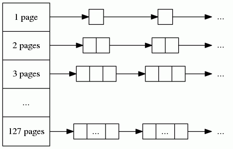</center>

An allocation for `k` pages is satisfied by looking in the `k`th free list. If that free list is empty, we look 
in the next free list, and so forth.  If no medium-object free list can satisfy the allocation, the allocation 
is treated as a large object.

<div id='section-id-93'/>

## Large Object Allocation

Allocations of 1MB or more are considered large allocations. Spans of free memory which can satisfy these allocations are tracked in a red-black tree sorted by size. Allocations follow the <em>best-fit</em> algorithm: the tree is searched to find the smallest span of free space which is larger than the requested allocation. The allocation is carved out of that span, and the remaining space is reinserted either into the large object tree or possibly into one of the smaller free-lists as appropriate.

If no span of free memory is located that can fit the requested allocation, we fetch memory from the system (using <code>sbrk</code>, <code>mmap</code>, or by mapping in portions of <code>/dev/mem</code>).</p>

If an allocation for `k` pages is satisfied by a run of pages of length > `k`, the remainder of the run is re-inserted back into the appropriate free list in the page heap.

<div id='section-id-102'/>

## Spans

The heap managed by TCMalloc consists of a set of pages. A run of contiguous pages is represented by a `Span` object. A span can either be _allocated_, or _free_. If free, the span is one of the entries in a page heap linked-list. If allocated, it is either a large object that has been handed off to the application, or a run of pages that have been split up into a sequence of small objects. If split into small objects, the size-class of the objects is recorded in the span.

A central array indexed by page number can be used to find the span to which a page belongs. For example, span _a_ below occupies 2 pages, span _b_ occupies 1 page, span _c_ occupies 5 pages and span _d_ occupies 3 pages.

<center>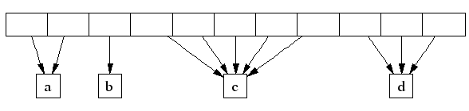</center>

In a 32-bit address space, the central array is represented by a a 2-level radix tree where the root contains 32 entries and each leaf contains 2^14 entries (a 32-bit address space has 2^19 8K pages, and the first level of tree divides the 2^19 pages by 2^5). This leads to a starting memory usage of 64KB of space (2^14*4 bytes) for the central array, which seems acceptable.

On 64-bit machines, we use a 3-level radix tree.

<div id='section-id-114'/>

## Deallocation

When an object is deallocated, we compute its page number and look it up in the central array to find the corresponding span object. The span tells us whether or not the object is small, and its size-class if it is small. If the object is small, we insert it into the appropriate free list in the current thread's thread cache. If the thread cache now exceeds a predetermined size (2MB by default), we run a garbage collector that moves unused objects from the thread cache into central free lists.

If the object is large, the span tells us the range of pages covered by the object. Suppose this range is `[p,q]`. We also lookup the spans for pages `p-1` and `q+1`. If either of these neighboring spans are free, we coalesce them with the `[p,q]` span. The resulting span is inserted into the appropriate free list in the page heap.

<div id='section-id-120'/>

## Central Free Lists for Small Objects

As mentioned before, we keep a central free list for each size-class. Each central free list is organized as a two-level data structure: a set of spans, and a linked list of free objects per span.

An object is allocated from a central free list by removing the first entry from the linked list of some span. (If all spans have empty linked lists, a suitably sized span is first allocated from the central page heap.)

An object is returned to a central free list by adding it to the linked list of its containing span. If the linked list length now equals the total number of small objects in the span, this span is now completely free and is returned to the page heap.

<div id='section-id-128'/>

## Garbage Collection of Thread Caches

Garbage collecting objects from a thread cache keeps the size of the cache under control and returns unused objects to the central free lists. Some threads need large caches to perform well while others can get by with little or no cache at all. When a thread cache goes over its `max_size`, garbage collection kicks in and then the thread competes with the other threads for a larger cache.

Garbage collection is run only during a deallocation. We walk over all free lists in the cache and move some number of objects from the free list to the corresponding central list.

The number of objects to be moved from a free list is determined using a per-list low-water-mark `L`. `L` records the minimum length of the list since the last garbage collection. Note that we could have shortened the list by `L` objects at the last garbage collection without requiring any extra accesses to the central list. We use this past history as a predictor of future accesses and move `L/2` objects from the thread cache free list to the corresponding central free list. This algorithm has the nice property that if a thread stops using a particular size, all objects of that size will quickly move from the thread cache to the central free list where they can be used by other threads.

If a thread consistently deallocates more objects of a certain size than it allocates, this `L/2` behavior will cause at least `L/2` objects to always sit in the free list. To avoid wasting memory this way, we shrink the maximum length of the freelist to converge on `num_objects_to_move` (see also [Sizing Thread Cache Free Lists](#sizing-thread-cache-free-lists)).

<pre>Garbage Collection
  if (L != 0 && max_length > num_objects_to_move) {
    max_length = max(max_length - num_objects_to_move, num_objects_to_move)
  }
</pre>

The fact that the thread cache went over its `max_size` is an indication that the thread would benefit from a larger cache. Simply increasing `max_size` would use an inordinate amount of memory in programs that have lots of active threads. Developers can bound the memory used with the flag --tcmalloc_max_total_thread_cache_bytes.

Each thread cache starts with a small `max_size` (e.g. 64KB) so that idle threads won't pre-allocate memory they don't need. Each time the cache runs a garbage collection, it will also try to grow its `max_size`. If the sum of the thread cache sizes is less than --tcmalloc_max_total_thread_cache_bytes, `max_size` grows easily. If not, thread cache 1 will try to steal from thread cache 2 (picked round-robin) by decreasing thread cache 2's `max_size`. In this way, threads that are more active will steal memory from other threads more often than they are have memory stolen from themselves. Mostly idle threads end up with small caches and active threads end up with big caches. Note that this stealing can cause the sum of the thread cache sizes to be greater than --tcmalloc_max_total_thread_cache_bytes until thread cache 2 deallocates some memory to trigger a garbage collection.

<div id='section-id-148'/>

## Performance Notes

<div id='section-id-150'/>

### PTMalloc2 unittest

The PTMalloc2 package (now part of glibc) contains a unittest program `t-test1.c`. This forks a number of threads and performs a series of allocations and deallocations in each thread; the threads do not communicate other than by synchronization in the memory allocator.

`t-test1` (included in `tests/tcmalloc/`, and compiled as `ptmalloc_unittest1`) was run with a varying numbers of threads (1-20) and maximum allocation sizes (64 bytes - 32Kbytes). These tests were run on a 2.4GHz dual Xeon system with hyper-threading enabled, using Linux glibc-2.3.2 from RedHat 9, with one million operations per thread in each test. In each case, the test was run once normally, and once with `LD_PRELOAD=libtcmalloc.so`.

The graphs below show the performance of TCMalloc vs PTMalloc2 for several different metrics. Firstly, total operations (millions) per elapsed second vs max allocation size, for varying numbers of threads. The raw data used to generate these graphs (the output of the `time` utility) is available in `t-test1.times.txt`.

<table>
<tr>
  <td>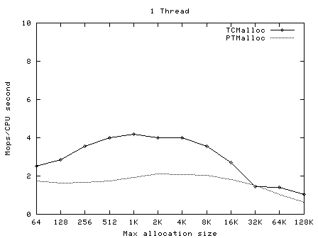</td>
  <td>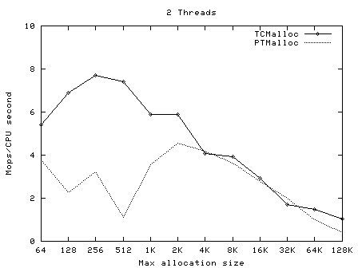</td>
  <td>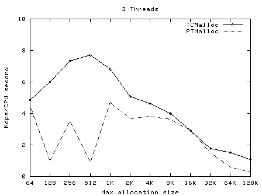</td>
</tr>
<tr>
  <td>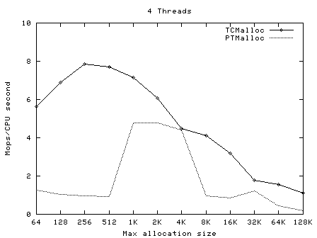</td>
  <td>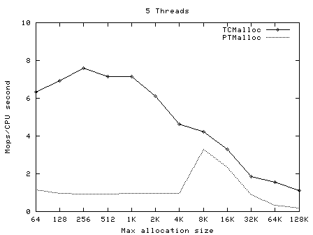</td>
  <td>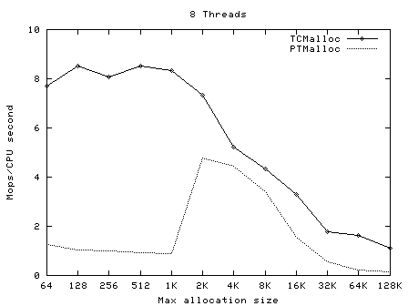</td>
</tr>
<tr>
  <td>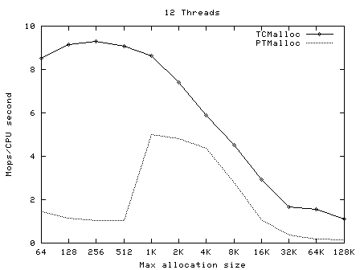</td>
  <td>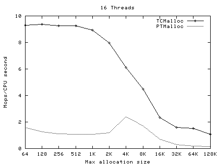</td>
  <td>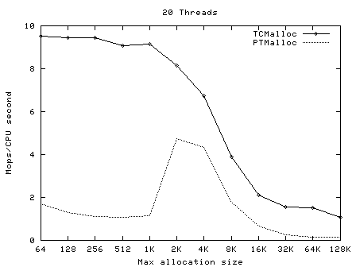</td>
</tr>
</table>


*   TCMalloc is much more consistently scalable than PTMalloc2 - for all thread counts >1 it achieves ~7-9 million ops/sec for small allocations, falling to ~2 million ops/sec for larger allocations. The single-thread case is an obvious outlier, since it is only able to keep a single processor busy and hence can achieve fewer ops/sec. PTMalloc2 has a much higher variance on operations/sec - peaking somewhere around 4 million ops/sec for small allocations and falling to <1 million ops/sec for larger allocations.
*   TCMalloc is faster than PTMalloc2 in the vast majority of cases, and particularly for small allocations. Contention between threads is less of a problem in TCMalloc.
*   TCMalloc's performance drops off as the allocation size increases. This is because the per-thread cache is garbage-collected when it hits a threshold (defaulting to 2MB). With larger allocation sizes, fewer objects can be stored in the cache before it is garbage-collected.
*   There is a noticeable drop in TCMalloc's performance at ~32K maximum allocation size; at larger sizes performance drops less quickly. This is due to the 32K maximum size of objects in the per-thread caches; for objects larger than this TCMalloc allocates from the central page heap.

Next, operations (millions) per second of CPU time vs number of threads, for max allocation size 64 bytes - 128 Kbytes.

<table>
<tr>
  <td>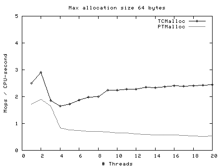</td>
  <td>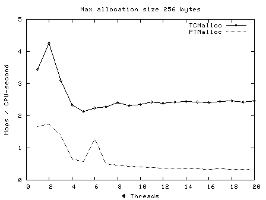</td>
  <td>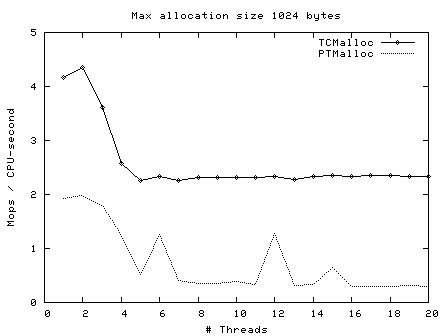</td>
</tr>
<tr>
  <td>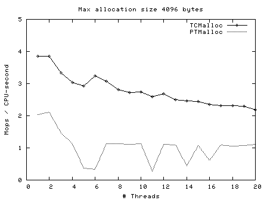</td>
  <td>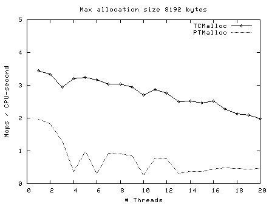</td>
  <td>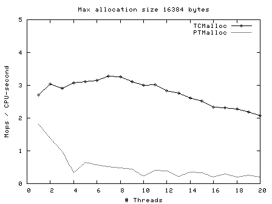</td>
</tr>
<tr>
  <td>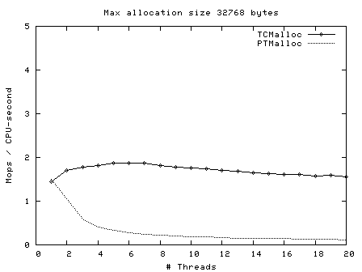</td>
  <td>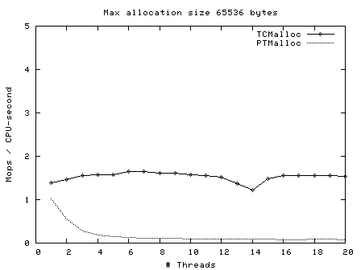</td>
  <td>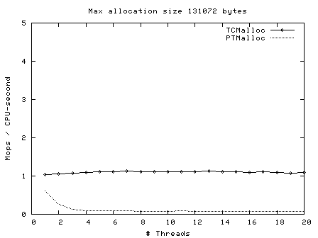</td>
</tr>
</table>

Here we see again that TCMalloc is both more consistent and more efficient than PTMalloc2\. For max allocation sizes <32K, TCMalloc typically achieves ~2-2.5 million ops per second of CPU time with a large number of threads, whereas PTMalloc achieves generally 0.5-1 million ops per second of CPU time, with a lot of cases achieving much less than this figure. Above 32K max allocation size, TCMalloc drops to 1-1.5 million ops per second of CPU time, and PTMalloc drops almost to zero for large numbers of threads (i.e. with PTMalloc, lots of CPU time is being burned spinning waiting for locks in the heavily multi-threaded case).

<div id='section-id-204'/>

## Modifying Runtime Behavior

You can more finely control the behavior of the tcmalloc via environment variables.

Generally useful flags:

<table frame="box" rules="sides" cellpadding="5" width="100%">
<tbody>
<tr valign="top">
<td><pre>TCMALLOC_SAMPLE_PARAMETER</pre></td>
<td>default: 0</td>
<td>The approximate gap between sampling actions. That is, we take one sample approximately once every `tcmalloc_sample_parmeter` bytes of allocation. This sampled heap information is available via `MallocExtension::GetHeapSample()` or `MallocExtension::ReadStackTraces()`. A reasonable value is 524288.</td>
</tr>
<tr valign="top">
<td><pre>TCMALLOC_RELEASE_RATE</pre></td>
<td>default: 1.0</td>
<td>Rate at which we release unused memory to the system, via `madvise(MADV_DONTNEED)`, on systems that support it. Zero means we never release memory back to the system. Increase this flag to return memory faster; decrease it to return memory slower. Reasonable rates are in the range [0,10].</td>
</tr>
<tr valign="top">
<td><pre>TCMALLOC_LARGE_ALLOC_REPORT_THRESHOLD</pre></td>
<td>default: 1073741824</td>
<td>Allocations larger than this value cause a stack trace to be dumped to stderr. The threshold for dumping stack traces is increased by a factor of 1.125 every time we print a message so that the threshold automatically goes up by a factor of ~1000 every 60 messages. This bounds the amount of extra logging generated by this flag. Default value of this flag is very large and therefore you should see no extra logging unless the flag is overridden.</td>
</tr>
<tr valign="top">
<td><pre>TCMALLOC_MAX_TOTAL_THREAD_CACHE_BYTES</pre></td>
<td>default: 16777216</td>
<td>Bound on the total amount of bytes allocated to thread caches. This bound is not strict, so it is possible for the cache to go over this bound in certain circumstances. This value defaults to 16MB. For applications with many threads, this may not be a large enough cache, which can affect performance. If you suspect your application is not scaling to many threads due to lock contention in TCMalloc, you can try increasing this value. This may improve performance, at a cost of extra memory use by TCMalloc. See [Garbage Collection](#Garbage_Collection) for more details.</td>
</tr>
</tbody>
</table>

Advanced "tweaking" flags, that control more precisely how tcmalloc tries to allocate memory from the kernel:

<table frame="box" rules="sides" cellpadding="5" width="100%">
<tbody>
<tr valign="top">
<td><pre>TCMALLOC_SKIP_MMAP</pre></td>
<td>default: false</td>
<td>If true, do not try to use `mmap` to obtain memory from the kernel.</td>
</tr>
<tr valign="top">
<td><pre>TCMALLOC_SKIP_SBRK</pre></td>
<td>default: false</td>
<td>If true, do not try to use `sbrk` to obtain memory from the kernel.</td>
</tr>
<tr valign="top">
<td><pre>TCMALLOC_DEVMEM_START</pre></td>
<td>default: 0</td>
<td>Physical memory starting location in MB for `/dev/mem` allocation. Setting this to 0 disables `/dev/mem` allocation.</td>
</tr>
<tr valign="top">
<td><pre>TCMALLOC_DEVMEM_LIMIT</pre></td>
<td>default: 0</td>
<td>Physical memory limit location in MB for `/dev/mem` allocation. Setting this to 0 means no limit.</td>
</tr>
<tr valign="top">
<td><pre>TCMALLOC_DEVMEM_DEVICE</pre></td>
<td>default: /dev/mem</td>
<td>Device to use for allocating unmanaged memory.</td>
</tr>
<tr valign="top">
<td><pre>TCMALLOC_MEMFS_MALLOC_PATH</pre></td>
<td>default: ""</td>
<td>If set, specify a path where hugetlbfs or tmpfs is mounted. This may allow for speedier allocations.</td>
</tr>
<tr valign="top">
<td><pre>TCMALLOC_MEMFS_LIMIT_MB</pre></td>
<td>default: 0</td>
<td>Limit total memfs allocation size to specified number of MB. 0 means "no limit".</td>
</tr>
<tr valign="top">
<td><pre>TCMALLOC_MEMFS_ABORT_ON_FAIL</pre></td>
<td>default: false</td>
<td>If true, abort() whenever memfs_malloc fails to satisfy an allocation.</td>
</tr>
<tr valign="top">
<td><pre>TCMALLOC_MEMFS_IGNORE_MMAP_FAIL</pre></td>
<td>default: false</td>
<td>If true, ignore failures from mmap.</td>
</tr>
<tr valign="top">
<td><pre>TCMALLOC_MEMFS_MAP_PRIVATE</pre></td>
<td>default: false</td>
<td>If true, use MAP_PRIVATE when mapping via memfs, not MAP_SHARED.</td>
</tr>
</tbody>
</table>

<div id='section-id-290'/>

## Modifying Behavior In Code

The `MallocExtension` class, in `malloc_extension.h`, provides a few knobs that you can tweak in your program, to affect tcmalloc's behavior.

<div id='section-id-294'/>

### Releasing Memory Back to the System

By default, tcmalloc will release no-longer-used memory back to the kernel gradually, over time. The [tcmalloc_release_rate](#modifying-runtime-behavior) flag controls how quickly this happens. You can also force a release at a given point in the progam execution like so:

<pre>   MallocExtension::instance()->ReleaseFreeMemory();
</pre>

You can also call `SetMemoryReleaseRate()` to change the `tcmalloc_release_rate` value at runtime, or `GetMemoryReleaseRate` to see what the current release rate is.

<div id='section-id-303'/>

### Memory Introspection

There are several routines for getting a human-readable form of the current memory usage:

```
   MallocExtension::instance()->GetStats(buffer, buffer_length);
   MallocExtension::instance()->GetHeapSample(&string);
   MallocExtension::instance()->GetHeapGrowthStacks(&string);
```

The last two create files in the same format as the heap-profiler, and can be passed as data files to pprof. The first is human-readable and is meant for debugging.

<div id='section-id-315'/>

### Generic Tcmalloc Status

TCMalloc has support for setting and retrieving arbitrary 'properties':

```
   MallocExtension::instance()->SetNumericProperty(property_name, value);
   MallocExtension::instance()->GetNumericProperty(property_name, &value);
```

It is possible for an application to set and get these properties, but the most useful is when a library sets the properties so the application can read them. Here are the properties TCMalloc defines; you can access them with a call like `MallocExtension::instance()->GetNumericProperty("generic.heap_size", &value);`:

<table frame="box" rules="sides" cellpadding="5" width="100%">
<tbody>
<tr valign="top">
<td><pre>generic.current_allocated_bytes</pre></td>
<td>Number of bytes used by the application. This will not typically match the memory use reported by the OS, because it does not include TCMalloc overhead or memory fragmentation.</td>
</tr>
<tr valign="top">
<td><pre>generic.heap_size</pre></td>
<td>Bytes of system memory reserved by TCMalloc.</td>
</tr>
<tr valign="top">
<td><pre>tcmalloc.pageheap_free_bytes</pre></td>
<td>Number of bytes in free, mapped pages in page heap. These bytes can be used to fulfill allocation requests. They always count towards virtual memory usage, and unless the underlying memory is swapped out by the OS, they also count towards physical memory usage.</td>
</tr>
<tr valign="top">
<td><pre>tcmalloc.pageheap_unmapped_bytes</pre></td>
<td>Number of bytes in free, unmapped pages in page heap. These are bytes that have been released back to the OS, possibly by one of the MallocExtension "Release" calls. They can be used to fulfill allocation requests, but typically incur a page fault. They always count towards virtual memory usage, and depending on the OS, typically do not count towards physical memory usage.</td>
</tr>
<tr valign="top">
<td><pre>tcmalloc.slack_bytes</pre></td>
<td>Sum of pageheap_free_bytes and pageheap_unmapped_bytes. Provided for backwards compatibility only. Do not use.</td>
</tr>
<tr valign="top">
<td><pre>tcmalloc.max_total_thread_cache_bytes</pre></td>
<td>A limit to how much memory TCMalloc dedicates for small objects. Higher numbers trade off more memory use for -- in some situations -- improved efficiency.</td>
</tr>
<tr valign="top">
<td><pre>tcmalloc.current_total_thread_cache_bytes</pre></td>
<td>A measure of some of the memory TCMalloc is using (for small objects).</td>
</tr>
</tbody>
</table>

<div id='section-id-359'/>

## Caveats

For some systems, TCMalloc may not work correctly with applications that aren't linked against `libpthread.so` (or the equivalent on your OS). It should work on Linux using glibc 2.3, but other OS/libc combinations have not been tested.

TCMalloc may be somewhat more memory hungry than other mallocs, (but tends not to have the huge blowups that can happen with other mallocs). In particular, at startup TCMalloc allocates approximately 240KB of internal memory.

Don't try to load TCMalloc into a running binary (e.g., using JNI in Java programs). The binary will have allocated some objects using the system malloc, and may try to pass them to TCMalloc for deallocation. TCMalloc will not be able to handle such objects.

---

<address>
Sanjay Ghemawat, Paul Menage  
Last modified: Feb 2018
</address>

[Link to main documentation readme](readme.md)
